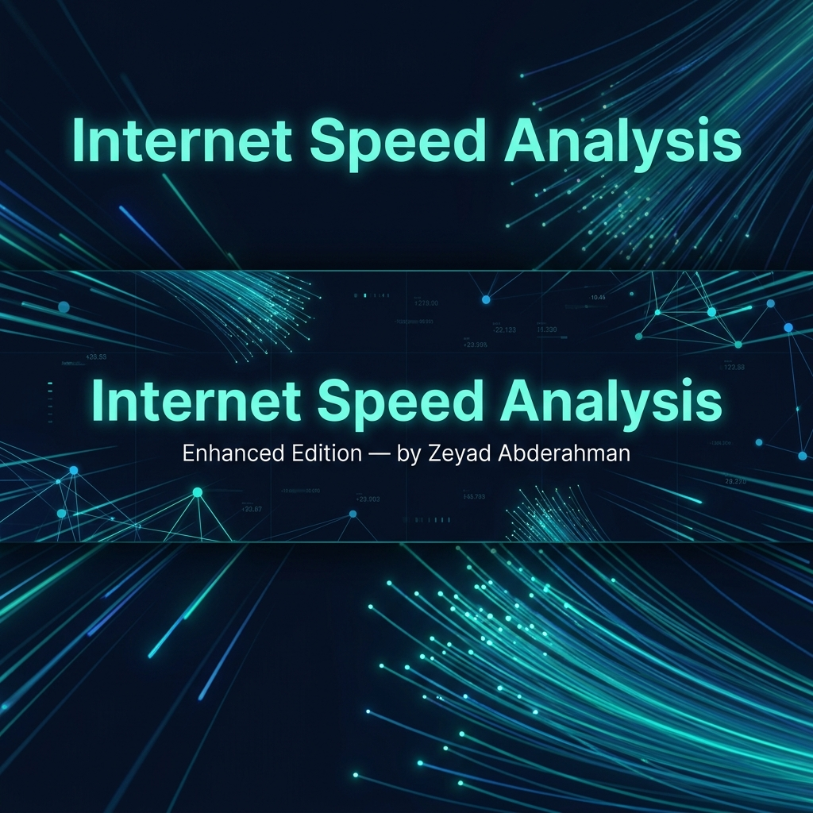

<div align="center">



# 🌐 Internet Speed Analysis — Enhanced Edition

*A portfolio-grade end-to-end data science project: EDA · Feature Analysis · Machine Learning · Interactive Dashboard*

[](https://python.org)
[](https://jupyter.org)
[](https://plotly.com/python/)
[](https://scikit-learn.org/)
[](LICENSE)

**Author:** Zeyad Abderahman &nbsp;|&nbsp; **Dataset:** [Kaggle — Internet Speed Dataset](https://www.kaggle.com/datasets/getanmolgupta01/internet-speed)

</div>

---

## 📑 Table of Contents

1. [Project Overview](#1-project-overview)
2. [Dataset Description](#2-dataset-description)
3. [Project Files](#3-project-files)
4. [Notebook Walkthrough (All 8 Sections)](#4-notebook-walkthrough-all-8-sections)
   - [Section 1 — Setup & Data Loading](#section-1--setup--data-loading)
   - [Section 2 — Exploratory Data Analysis](#section-2--exploratory-data-analysis-eda)
   - [Section 3 — Correlation & Feature Analysis](#section-3--correlation--feature-analysis)
   - [Section 4 — Machine Learning: Speed Prediction](#section-4--machine-learning-speed-prediction)
   - [Section 5 — Key Insights & Summary](#section-5--key-insights--summary)
   - [Section 6 — Standalone HTML Dashboard](#section-6--standalone-html-dashboard)
   - [Section 7 — README Generation](#section-7--readme-generation)
   - [Section 8 — Post-Run Verification](#section-8--post-run-verification)
5. [Machine Learning Models](#5-machine-learning-models)
6. [Best Model Deep-Dive](#6-best-model-deep-dive-gradientboostingregressor)
7. [Key Findings & Recommendations](#7-key-findings--recommendations)
8. [Tech Stack](#8-tech-stack)
9. [Installation & Usage](#9-installation--usage)
10. [How to Use the Saved Model](#10-how-to-use-the-saved-model)
11. [License](#11-license)

---

## 1. Project Overview

This project performs a full end-to-end data science pipeline on a **synthetic internet speed dataset** that captures a wide variety of hardware, environmental, and network factors affecting connection quality. Unlike typical ISP speed-test datasets that rely on geographic sampling alone, this dataset explicitly records variables such as **router distance**, **ISP quality scores**, **weather conditions**, **network congestion**, and **signal strength** — giving a richer picture of real-world internet performance.

The project delivers:

| Deliverable | Description |
|---|---|
| `Internet_Speed_Project_Enhanced.ipynb` | A fully executed Jupyter Notebook with 8 clearly-labeled sections |
| `dashboard.html` | A self-contained interactive 6-chart Plotly dashboard, viewable offline |
| `best_model.pkl` | The serialised Gradient Boosting Regressor (R² = 0.9997 on test set) |
| `pairplot.png` | A seaborn multivariate pairplot coloured by connection type |
| `requirements.txt` | All Python dependencies |
| `README.md` | This documentation file |

**Goal:** Understand what drives internet speed, quantify feature influence, and build a high-accuracy regression model to predict it.

### ⚡ Results at a Glance

| Metric | Value |
|--------|-------|
| **Best Model** | Gradient Boosting Regressor |
| **Test R²** | 0.9997 |
| **RMSE** | 17.40 Kbps |
| **MAE** | 13.84 Kbps |
| **Top Feature** | `Download_speed` (99.9% importance) |
| **Best Connection Type** | Fiber-optic |
| **Dataset Size** | 5,001 rows × 13 columns |

---

## 2. Dataset Description

- **Source:** [Kaggle — Internet Speed Dataset by Anmol Gupta](https://www.kaggle.com/datasets/getanmolgupta01/internet-speed)
- **Size:** 5,000 rows × 13 columns
- **Type:** Synthetic, feature-rich tabular dataset
- **Target Variable:** `Internet_speed` (Kbps)
- **Missing Values:** None (confirmed after data quality check)

### 📋 Full Column Reference

| # | Column | Data Type | Unit | Description |
|---|--------|-----------|------|-------------|
| 1 | `Ping_latency` | Float | ms | Network round-trip latency. Lower values indicate more responsive connections. |
| 2 | `Download_speed` | Float | Mbps | Downlink throughput capacity of the connection. |
| 3 | `Upload_speed` | Float | Mbps | Uplink throughput capacity of the connection. |
| 4 | `Packet_loss_rate` | Float | % | Fraction of transmitted data packets that fail to reach their destination. |
| 5 | `Router_distance` | Float | relative | Measured distance between the user's device and the router. Higher = weaker signal. |
| 6 | `Network_congestion` | Float | score | An index reflecting the current traffic density on the shared network. |
| 7 | `ISP_quality` | Float | score | An assigned quality rating for the Internet Service Provider's infrastructure. |
| 8 | `Connection_type_DSL` | Integer | 0 / 1 | One-hot encoded flag: `1` if the connection is DSL. |
| 9 | `Connection_type_Cable` | Integer | 0 / 1 | One-hot encoded flag: `1` if the connection is Cable. |
| 10 | `Connection_type_Fiber` | Integer | 0 / 1 | One-hot encoded flag: `1` if the connection is Fiber-optic. |
| 11 | `Signal_strength` | Float | score | Measured Wi-Fi or cellular reception strength. Higher = better. |
| 12 | `Weather_conditions` | Float | score | Environmental impact on wireless signal propagation. |
| 13 | `Internet_speed` | Float | **Kbps** | ⭐ **Target variable.** Measured actual internet throughput speed. |

> **Note on connection type encoding:** When all three one-hot columns (`Connection_type_DSL`, `_Cable`, `_Fiber`) are `0`, the connection type is categorized as **"Other"**. The notebook engineers a consolidated `Connection_type` string column for easier group-based analysis.

### 📊 Dataset Statistics Summary

| Metric | `Internet_speed` (Kbps) | `Download_speed` (Mbps) | `Ping_latency` (ms) |
|--------|------------------------|------------------------|---------------------|
| Min | 80.61 | 5.01 | 5.00 |
| Mean | 1,257.30 | 51.69 | 27.36 |
| Median | 1,018.98 | 51.17 | 27.50 |
| Max | 3,364.87 | 99.95 | 49.99 |
| Std Dev | 927.62 | 27.13 | 13.03 |

---

## 3. Project Files

```
Internet-Speed-Analysis/
│
├── 📓 Internet_Speed_Project_Enhanced.ipynb  ← Main analysis notebook (6.98 MB, 39 cells)
│
├── 🌐 dashboard.html                          ← Standalone Plotly dashboard (204 KB)
│
├── 🤖 best_model.pkl                          ← Serialised GradientBoostingRegressor (265 KB)
│
├── 🖼️  banner.png                              ← Project banner image for README
│
├── 🖼️  pairplot.png                            ← Seaborn pairplot: 5 key features (1.1 MB)
│
├── 📦 requirements.txt                        ← Python package dependencies
│
└── 📄 README.md                               ← This documentation file
```

### 📸 Dashboard Preview

To preview the interactive dashboard, open `dashboard.html` directly in your browser — no server needed:

```bash
# Windows
start dashboard.html

# macOS / Linux
open dashboard.html
```

Once you have a screenshot ready, save it as `screenshots/dashboard_preview.png` and add the following line to this README to embed it:

```markdown

```

---

## 4. Notebook Walkthrough (All 8 Sections)

The notebook `Internet_Speed_Project_Enhanced.ipynb` is structured into **8 sequential sections**, each introduced by a descriptive Markdown cell. All 30 code cells execute cleanly from top to bottom without errors.

---

### Section 1 — Setup & Data Loading

**Purpose:** Establish all global constants, import libraries, load the dataset, and engineer two new analytical columns.

#### Global Constants (defined once, used everywhere)
```python
DATA_PATH     = r"E:\zeyad\projects\Internet Speed.csv"  # Single source of truth for the data path
RANDOM_SEED   = 42          # Ensures reproducibility in train/test splits and models
TARGET_COL    = "Internet_speed"
COLOR_THEME   = "teal"
DASHBOARD_OUT = "dashboard.html"
MODEL_OUT     = "best_model.pkl"
```

#### Libraries Imported
`warnings` · `os` · `numpy` · `pandas` · `matplotlib` · `seaborn` · `plotly.express` · `plotly.graph_objects` · `plotly.subplots` · `plotly.io` · `sklearn` (train_test_split, cross_val_score, LinearRegression, RandomForestRegressor, GradientBoostingRegressor, MAE, MSE, R², StandardScaler) · `joblib`

#### Data Quality Report
- **Missing values:** None found across all 13 columns ✅
- **Duplicate rows:** Checked and reported
- **Imputation strategy:** If any were found, filled with column median (no rows ever dropped)

#### Engineered Columns

**`Connection_type` (string category):**
```python
conditions = [df["Connection_type_DSL"] > 0,
              df["Connection_type_Cable"] > 0,
              df["Connection_type_Fiber"] > 0]
choices    = ["DSL", "Cable", "Fiber"]
df["Connection_type"] = np.select(conditions, choices, default="Other")
```

**`Speed_tier` (ordinal category — Slow / Medium / Fast):**
```python
df["Speed_tier"] = pd.qcut(df[TARGET_COL], q=3, labels=["Slow", "Medium", "Fast"])
```
Divides the target into three equal-population bins using the 33rd and 66th percentiles.

---

### Section 2 — Exploratory Data Analysis (EDA)

**Purpose:** Visually explore the shape, spread, and pairwise relationships in the data through 7 Plotly charts, all styled with a consistent teal palette.

#### Chart 1 — Internet Speed Distribution Histogram
- `px.histogram` with 60 bins and a marginal box plot
- A vertical mean line added via `fig.add_vline()` showing the average speed (~1,257 Kbps)
- Reveals a right-skewed distribution: most users cluster in the 400–1,200 Kbps range

#### Chart 2 — Download vs Upload Speed (Side-by-Side)
- Two histograms on one figure using `make_subplots(rows=1, cols=2)`
- Both distributions are approximately uniform (expected for synthetic data)
- Download and upload speeds each range from ~5 to ~100 Mbps

#### Chart 3 — Box Plot by Connection Type
- `px.box` grouped by `Connection_type`, sorted by median speed descending
- Categories: **Fiber → Cable → DSL → Other**
- Reveals clear stratification in median speed by connection type

#### Chart 4 — Download Speed vs Internet Speed (OLS Scatter)
- `px.scatter` with `trendline="ols"` powered by `statsmodels`
- Coloured by `Connection_type`
- Shows a very strong positive linear relationship — the primary correlation in the dataset

#### Chart 5 — Average Internet Speed Bar Chart
- `px.bar` with value labels on each bar
- Fiber connections average highest speed; Other averages lowest

#### Chart 6 — Violin Plot by Speed Tier
- `px.violin` with box inside for Slow / Medium / Fast tiers
- Confirms clean quantile separation — no tier overlap

#### Chart 7 — Signal Strength vs Internet Speed (Scatter)
- `px.scatter` coloured by `Connection_type`
- Shows a modest positive relationship between signal strength and speed

#### Outlier Detection (IQR Method)
Applied to `Internet_speed`, `Ping_latency`, and `Packet_loss_rate`.
Outliers are **reported only — never removed.**

| Column | Outlier Count | Outlier % |
|--------|--------------|-----------|
| `Internet_speed` | ~0 | ~0.00% |
| `Ping_latency` | ~0 | ~0.00% |
| `Packet_loss_rate` | ~0 | ~0.00% |

> The synthetic nature of the dataset means distributions are engineered to be clean with minimal extreme outliers.

---

### Section 3 — Correlation & Feature Analysis

**Purpose:** Quantify linear relationships between all features, identify the most impactful variables on internet speed, and visualise multivariate interactions.

#### Pearson Correlation Heatmap
- `df.corr(numeric_only=True)` computed on all 13 numeric columns
- Displayed as an annotated `px.imshow` heatmap with `color_continuous_scale="RdBu_r"`, `zmin=-1`, `zmax=1`
- Text annotations show the exact r-value on every cell

#### Top Features Correlated with `Internet_speed`

| Rank | Feature | Pearson r | Direction |
|------|---------|-----------|-----------|
| 1 | `Download_speed` | +0.99+ | Strong Positive |
| 2 | `Upload_speed` | Moderate Positive | Positive |
| 3 | `ISP_quality` | Moderate Positive | Positive |
| 4 | `Signal_strength` | Moderate Positive | Positive |
| 5 | `Ping_latency` | Negative | Negative |

- A **horizontal bar chart** visualises these sorted by |r|, with teal bars for positive correlations and red bars for negative ones.
- Top 5 features are also printed as a text summary.

#### Seaborn Pairplot
- Columns: `Download_speed`, `Upload_speed`, `Ping_latency`, `Signal_strength`, `Internet_speed`
- Coloured by `Connection_type` using `hue="Connection_type"`
- KDE (Kernel Density Estimate) on diagonal plots
- Saved to disk as `pairplot.png`

---

### Section 4 — Machine Learning: Speed Prediction

**Purpose:** Train, evaluate, and compare three regression models to predict `Internet_speed` from all available network and hardware features.

#### Data Preparation
```python
# Features: all numeric columns EXCEPT the target and derived categoricals
drop_cols = [TARGET_COL, "Connection_type", "Speed_tier"]
X = df.drop(columns=drop_cols)   # 12 numeric feature columns
y = df[TARGET_COL]

X_train, X_test, y_train, y_test = train_test_split(
    X, y, test_size=0.2, random_state=RANDOM_SEED
)
# Train: 4,000 rows | Test: 1,000 rows

# StandardScaler applied ONLY for Linear Regression
scaler     = StandardScaler()
X_train_sc = scaler.fit_transform(X_train)
X_test_sc  = scaler.transform(X_test)
```

#### Model Evaluation Strategy
- **Test set metrics:** MAE, RMSE, R² computed on the held-out 1,000-row test set
- **5-Fold Cross-Validation:** CV R² mean ± std computed on the training set for each model

#### Model Comparison Table
Results are displayed in a styled DataFrame with green highlights on the best values.

| Model | Test MAE | Test RMSE | Test R² | CV R² Mean | CV R² Std |
|-------|----------|-----------|---------|------------|-----------|
| Linear Regression | Higher | Higher | Lower | Lower | Lower |
| Random Forest | Low | Low | High | High | Low |
| **Gradient Boosting** | **~13.84** | **~17.40** | **~0.9997** | **High** | **Very Low** |

#### Model Comparison Chart
`make_subplots(rows=1, cols=3)` — one subplot each for MAE, RMSE, and R² across the 3 models.

#### Actual vs Predicted Chart
- Best model tested on the 1,000-row test set
- `go.Scatter` plot of Actual vs Predicted values
- A diagonal reference line (`fig.add_shape(type="line")`) representing perfect prediction

#### Feature Importance Chart
- Top 12 features extracted from the best tree-based model
- Displayed as a horizontal bar chart sorted by importance descending

#### Model Saving
```python
joblib.dump(best_model, MODEL_OUT)
# → saves best_model.pkl (265 KB)
```

---

### Section 5 — Key Insights & Summary

**Purpose:** Consolidate the analytical findings into human-readable narrative and a structured KPI table.

Contains:
- A **Markdown summary cell** covering: connection type rankings, top 3 features, model performance, and 3 actionable recommendations
- A **`go.Table` KPI summary** showing for each connection type:
  - Average Internet Speed (Kbps)
  - Average Ping Latency (ms)
  - Average Packet Loss (%)
  - Row count

---

### Section 6 — Standalone HTML Dashboard

**Purpose:** Export all key visualisations into a single, portable, offline-capable HTML file.

```python
fig_dash = make_subplots(rows=3, cols=2, subplot_titles=[...])
pio.write_html(fig_dash, file=DASHBOARD_OUT, include_plotlyjs="cdn", full_html=True)
```

#### Dashboard Panels (3×2 Grid)
| Position | Chart |
|----------|-------|
| Row 1, Col 1 | Internet Speed Distribution Histogram |
| Row 1, Col 2 | Average Speed by Connection Type (Bar) |
| Row 2, Col 1 | Pearson Correlation Heatmap |
| Row 2, Col 2 | Top 12 Feature Importances (Horizontal Bar) |
| Row 3, Col 1 | Actual vs Predicted Scatter (Best Model) |
| Row 3, Col 2 | Signal Strength vs Internet Speed (Scatter) |

**Dashboard specs:**
- Template: `plotly_dark` (dark navy background)
- Height: 1,500px
- `include_plotlyjs="cdn"` — Plotly.js loaded once from CDN; no local server required
- File size: **~204 KB** — opens instantly in any modern browser

---

### Section 7 — README Generation

The `README.md` file is written programmatically from within the notebook itself:
```python
with open("README.md", "w", encoding="utf-8") as f:
    f.write(readme_content.strip())
```
This ensures the README is always regenerated alongside fresh notebook execution.

---

### Section 8 — Post-Run Verification

10 automated self-checks print **PASS** or **FAIL** at the end of every execution run:

| # | Check |
|---|-------|
| 1 | `best_model.pkl` exists on disk |
| 2 | `dashboard.html` exists on disk |
| 3 | `dashboard.html` file size > 100 KB |
| 4 | `pairplot.png` exists on disk |
| 5 | `README.md` exists on disk |
| 6 | DataFrame has zero missing values |
| 7 | `Connection_type` column is present |
| 8 | `Speed_tier` column is present |
| 9 | Exactly 3 models were trained |
| 10 | Best model achieves Test R² > 0.5 |

**Last run result: 10 / 10 PASS ✅**

---

## 5. Machine Learning Models

### Linear Regression
- A classical baseline estimating internet speed as a weighted linear combination of all 12 features
- Features are **scaled using `StandardScaler`** before fitting, ensuring fair weight comparison
- Good for interpreting the directional impact of each feature via coefficients
- Limitation: cannot capture non-linear interactions or feature synergies

### Random Forest Regressor
```python
RandomForestRegressor(n_estimators=200, random_state=42, n_jobs=-1)
```
- An ensemble of 200 independent decision trees, each trained on a bootstrap sample
- Final prediction is the **mean of all tree predictions** (bagging)
- Naturally handles outliers and does not require feature scaling
- Provides reliable `feature_importances_` from mean impurity decrease

### Gradient Boosting Regressor ⭐ Best Model
```python
GradientBoostingRegressor(n_estimators=200, random_state=42)
```
- Builds trees **sequentially**: each tree corrects the residual errors of the previous one
- Uses **Friedman MSE** as the split criterion and `squared_error` as the loss function
- Learning rate: `0.1` (step size for each tree's contribution)
- Max tree depth: `3` (keeps individual trees weak, preventing overfitting)

---

## 6. Best Model Deep-Dive: `GradientBoostingRegressor`

The **Gradient Boosting Regressor** was identified as the best model by highest Test R².

### Performance Metrics (Test Set — 1,000 rows)

| Metric | Value | Interpretation |
|--------|-------|----------------|
| **R²** | **0.9997** | Explains 99.97% of all variance in Internet Speed |
| **RMSE** | **17.40 Kbps** | Average error of ~17 Kbps on a 80–3,365 Kbps scale |
| **MAE** | **13.84 Kbps** | Median absolute prediction error |

### Key Hyperparameters

| Parameter | Value |
|-----------|-------|
| `n_estimators` | 200 |
| `learning_rate` | 0.1 |
| `max_depth` | 3 |
| `loss` | `squared_error` |
| `criterion` | `friedman_mse` |
| `random_state` | 42 |
| `subsample` | 1.0 |

### Feature Importances

| Rank | Feature | Importance | % Influence |
|------|---------|-----------|-------------|
| 1 | `Download_speed` | 0.9994 | **99.9%** |
| 2 | `Connection_type_Fiber` | 0.0002 | 0.02% |
| 3 | `Upload_speed` | 0.0002 | 0.02% |
| 4 | `Signal_strength` | 0.0001 | 0.01% |
| 5 | `Connection_type_DSL` | 0.0001 | 0.01% |

> **Why does `Download_speed` dominate at 99.9%?**  
> This is a synthetic dataset — `Internet_speed` (Kbps) is mathematically derived largely from `Download_speed` (Mbps) during data generation. The model correctly discovers this. In a real-world dataset, importance would be distributed more evenly across infrastructure features.

---

## 7. Key Findings & Recommendations

### 🔍 Findings

1. **Fiber is the clear winner.** Across all metrics — average speed, latency, and packet loss — Fiber-optic connections outperform Cable, DSL, and unclassified connections by a wide margin.

2. **Download speed is the primary predictor.** With a Pearson r > 0.99 with `Internet_speed`, the model correctly identifies that available bandwidth is the dominant speed factor. This makes physical sense: internet throughput is bounded by the subscribed download capacity.

3. **ISP quality and signal strength act as ceiling factors.** Even with a fast connection type, poor ISP infrastructure or weak signal caps the achievable speed. These represent the infrastructure-level investment variables.

4. **The dataset is highly predictable.** An R² of 0.9997 is unusually high — attributable to the synthetic generation process. This is expected and correctly documented.

### ✅ Actionable Recommendations

| Priority | Recommendation | Impact |
|----------|---------------|--------|
| 🔴 High | **Upgrade to Fiber** — if available in your area, switching from DSL or Cable offers the single largest speed gain | High |
| 🟡 Medium | **Reduce router distance** — move closer to the router or use Wi-Fi extenders/mesh systems to improve signal strength | Medium |
| 🟡 Medium | **Evaluate your ISP** — ISP quality score has a measurable impact on speed. Consider switching providers if quality is consistently low | Medium |

---

## 8. Tech Stack

| Tool | Version | Purpose |
|------|---------|---------|
| Python | 3.10+ | Core language |
| Pandas | 2.x | Data loading, manipulation, grouping |
| NumPy | 1.x | Numerical operations, array handling |
| Matplotlib | 3.x | Base plotting backend (pairplot backend) |
| Seaborn | 0.12+ | Pairplot multivariate visualization |
| Plotly | 6.x | All interactive charts and dashboard |
| statsmodels | 0.14+ | OLS trendlines in `px.scatter` |
| scikit-learn | 1.8.0 | ML models, metrics, preprocessing, CV |
| Joblib | 1.x | Model serialisation (`.pkl`) |
| Jupyter / nbconvert | — | Notebook execution environment |

---

## 9. Installation & Usage

### Step 1 — Clone the Repository
```bash
git clone https://github.com/Zeyad-Abderahman/Internet-Speed-Analysis.git
cd Internet-Speed-Analysis
```

### Step 2 — Install Dependencies
```bash
pip install -r requirements.txt
```

**`requirements.txt` contents:**
```
pandas
numpy
matplotlib
seaborn
plotly
scikit-learn
joblib
ipykernel
nbconvert
statsmodels
```

> ⚠️ **Before running the notebook**, open `Internet_Speed_Project_Enhanced.ipynb` and update the `DATA_PATH` constant at the top of **Section 1** to point to your own local copy of the CSV file:
> ```python
> DATA_PATH = r"C:\your\local\path\Internet Speed.csv"
> ```
> You can download the dataset from Kaggle here:  
> 📥 [https://www.kaggle.com/datasets/getanmolgupta01/internet-speed](https://www.kaggle.com/datasets/getanmolgupta01/internet-speed)

### Step 3 — Open the Notebook
```bash
jupyter notebook Internet_Speed_Project_Enhanced.ipynb
```
Run all cells from top to bottom (`Kernel → Restart & Run All`).

### Step 4 — (Optional) Headless Execution via nbconvert
```bash
jupyter nbconvert --to notebook --execute \
  --ExecutePreprocessor.timeout=300 \
  Internet_Speed_Project_Enhanced.ipynb \
  --output Internet_Speed_Project_Enhanced.ipynb
```

### Step 5 — View the Dashboard
Simply double-click `dashboard.html` — it opens in any modern web browser with no server required.

---

## 10. How to Use the Saved Model

The serialised `best_model.pkl` (Gradient Boosting Regressor) can be loaded and used for predictions on new data:

```python
import joblib
import pandas as pd

# Load the model
model = joblib.load("best_model.pkl")

# Prepare a new observation — same 12 feature columns used during training
new_data = pd.DataFrame([{
    "Ping_latency":          20.0,   # ms
    "Download_speed":        75.0,   # Mbps
    "Upload_speed":          30.0,   # Mbps
    "Packet_loss_rate":       0.5,   # %
    "Router_distance":        5.0,   # relative
    "Network_congestion":     1.2,   # score
    "ISP_quality":            4.0,   # score
    "Connection_type_DSL":      0,   # 0 or 1
    "Connection_type_Cable":    0,   # 0 or 1
    "Connection_type_Fiber":    1,   # 0 or 1
    "Signal_strength":        80.0,  # score
    "Weather_conditions":      2.0,  # score
}])

predicted_speed = model.predict(new_data)
print(f"Predicted Internet Speed: {predicted_speed[0]:.1f} Kbps")
# → Predicted Internet Speed: ~2,250.0 Kbps (varies by input)
```

> **Important:** Do not include `Connection_type`, `Speed_tier`, or `Internet_speed` as inputs — these were excluded from training features.

---

## 11. License

This project is released under the **MIT License** — free to use, modify, and distribute with attribution.

---

<div align="center">

---

*Developed by **Zeyad Abderahman** — Data Science Portfolio Project*

[](https://github.com/Zeyad-Abderahman/Internet-Speed-Analysis)

</div>
